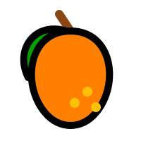

<table border="0">
  <tr>
    <td width="200" align="center" valign="top">
      
    </td>
    <td valign="top">
      <h1>mangofetch-cli</h1>
      <p><strong>Fast, Tropical, Pure Rust CLI.</strong><br/>
      <em>The scriptable, non-interactive command-line interface frontend of the mangoSuite.</em></p>
      <p>
        <a href="https://crates.io/crates/mangofetch"></a>
        <a href="LICENSE"></a>
        
        
        
      </p>
    </td>
  </tr>
</table>

---

<!--toc:start-->
- [Overview](#overview)
- [The mangoSuite](#the-mangosuite)
- [Cross-Platform Compatibility](#cross-platform-compatibility)
- [CLI Installation](#cli-installation)
  - [Via Cargo (Recommended)](#via-cargo-recommended)
  - [From Source](#from-source)
- [Usage & Command Reference](#usage--command-reference)
- [License](#license)
<!--toc:end-->

## Overview

`mangofetch-cli` is a scriptable command-line interface download utility designed for fast, asynchronous downloads. It is optimized for server environments, automated cron jobs, scripts, and users who prefer a pure CLI over a graphical or interactive interface.

It leverages the **`mangofetch-core`** engine to download media from over 1000 platforms via YouTube, Torrents, SoundCloud, and Instagram extraction under the hood.

## The mangoSuite

`mangofetch-cli` is part of the `mangoSuite` modularized stack:
* **[mangofetch](https://github.com/julesklord/mangofetch)**: Core engine SDK and interactive Ratatui TUI.
* **[mangofetch-cli](https://github.com/julesklord/mangofetch-cli)** (This repo): Non-interactive, scriptable CLI frontend.
* **[mangofetch-gui](https://github.com/julesklord/mangofetch-gui)**: Hardware-accelerated desktop GUI built with `egui` & `eframe`.

## Cross-Platform Compatibility

- **Operating Systems:** Windows (10/11), macOS, GNU/Linux, and BSD.
- **Architectures:** AMD64, ARM64, and ARMv7.
- **Dependency Management:** The underlying engine detects missing binaries like `yt-dlp`, `ffmpeg`, or `aria2c` and automatically provisions them for your OS.

---

## CLI Installation

### Via Cargo (Recommended)

Install the CLI to your system path:

```zsh
cargo install mangofetch-cli
```

### From Source

```zsh
git clone https://github.com/julesklord/mangofetch-cli.git
cd mangofetch-cli
cargo build --release
```

---

## Usage & Command Reference

```zsh
mangofetch-cli <command> [args]
```

### Command List

| Command                          | Alias | Description                                             |
| :------------------------------- | :---- | :------------------------------------------------------ |
| `mangofetch-cli download <url>`  | `d`   | Download media from a single link.                     |
| `mangofetch-cli download-multiple <file>`| `dm`| Batch process links from a text file.                |
| `mangofetch-cli info <url>`      | `i`   | View metadata cards without downloading.                |
| `mangofetch-cli list`            | `ls`  | View current queue and recovery items.                  |
| `mangofetch-cli clean`           | `c`   | Clear download history and system cache.               |
| `mangofetch-cli config`          | `cfg` | Get, set, or list application configurations.           |
| `mangofetch-cli check`           | `ch`  | Verify system dependencies (yt-dlp, FFmpeg).            |
| `mangofetch-cli update`          | `up`  | Update provisioning binaries.                           |
| `mangofetch-cli logs`            | `log` | Tail debug and download logs.                           |
| `mangofetch-cli about`           | `a`   | Show version, licensing, and roadmap details.           |

## Local Development

Since this repository resolves `mangofetch-core` directly from crates.io for distribution, you can configure your local workspace to use a path override for development. Add the following to the end of the root `Cargo.toml` in your local development workspace to point to your local copy of `mangofetch`:

```toml
[patch.crates-io]
mangofetch-core = { path = "../mangofetch/mangofetch-core" }
mangofetch-plugin-sdk = { path = "../mangofetch/mangofetch-plugin-sdk" }
```

---

## License

<p align="center">
  Built by <a href="https://github.com/julesklord">Jules</a> and Claude.<br>
  Released under the GPL-3.0 License.
</p>
